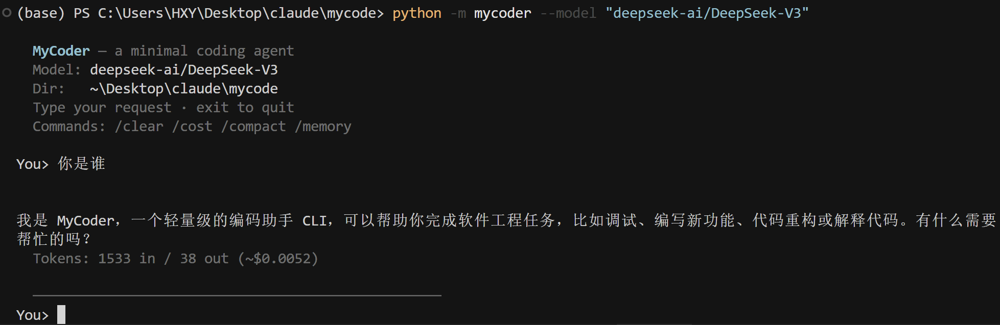
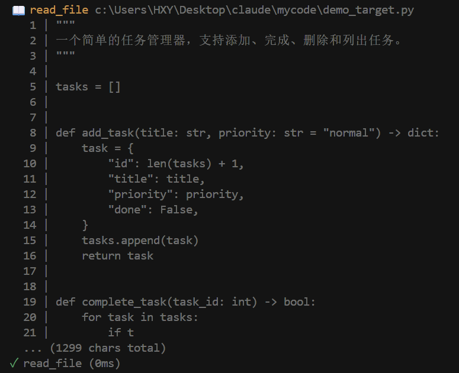

# MyCoder

<div align="center">

**一个轻量级的 AI 代码助手 CLI**


</div>

---

## 效果预览

**启动与对话**


**工具调用**


---

## 功能特性

- 💬 **交互式 REPL** — 持续对话，支持中途打断（Ctrl+C）
- ⚡ **单次执行** — 传入 prompt 直接运行，完成后退出
- 🛠️ **7 个内置工具** — 读 / 写 / 编辑文件、目录列表、内容搜索、终端命令、网页抓取
- 💾 **会话持久化** — 对话自动保存，`--resume` 恢复上次进度
- 🧠 **记忆系统** — 跨会话保存关键信息，下次启动自动加载
- 📦 **上下文压缩** — 接近 token 上限时自动压缩，保持对话连贯
- 🔒 **权限控制** — 四种模式灵活控制工具执行权限

---

## 快速开始

### 安装

```bash
git clone https://github.com/SoloMinerva/Mycoder.git
cd Mycoder
pip install -e .
```

### 配置 API Key

将 `.env.example` 复制为 `.env`，填入你的 API Key：

```bash
cp .env.example .env
```

**Anthropic：**
```bash
ANTHROPIC_API_KEY=sk-ant-...
```

**OpenAI 兼容接口**（SiliconFlow、DeepSeek、本地 Ollama 等）：
```bash
OPENAI_API_KEY=sk-...
OPENAI_BASE_URL=https://api.siliconflow.cn/v1
```

### 启动

```bash
mycoder                                       # 交互式 REPL
mycoder "帮我修复 app.py 里的 bug"             # 单次执行
mycoder --model deepseek-ai/DeepSeek-V3      # 指定模型
mycoder --yolo "跑一遍所有测试"               # 跳过所有确认
mycoder --resume                              # 恢复上次会话
```

---

## REPL 命令

| 命令 | 说明 |
|------|------|
| `/clear` | 清空当前对话历史 |
| `/cost` | 查看 token 用量和费用估算 |
| `/compact` | 手动压缩上下文 |
| `/memory` | 查看已保存的记忆 |
| `exit` · `quit` | 退出 MyCoder |

---

## 权限模式

| 参数 | 行为 |
|------|------|
| *(默认)* | 编辑文件和执行命令前弹出确认 |
| `--accept-edits` | 自动同意文件编辑，命令仍需确认 |
| `--dont-ask` | 自动拒绝所有确认 |
| `--yolo` | 跳过所有确认，全自动执行 |

---

## 工作原理

```
用户输入
   │
   ▼
┌─────────────┐     工具调用      ┌──────────────┐
│     LLM     │ ───────────────▶ │   工具执行    │
│  (推理决策)  │ ◀─────────────── │  读/写/搜索…  │
└─────────────┘     工具结果      └──────────────┘
   │
   ▼
输出回复 + 自动保存会话
```

---

## License

[MIT](./LICENSE) © 2026 SoloMinerva
